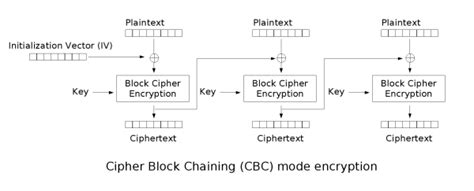
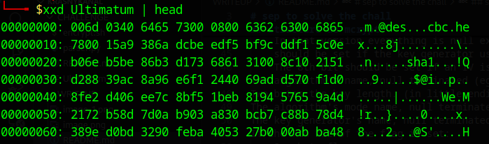
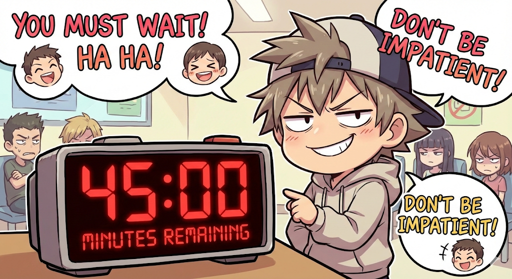
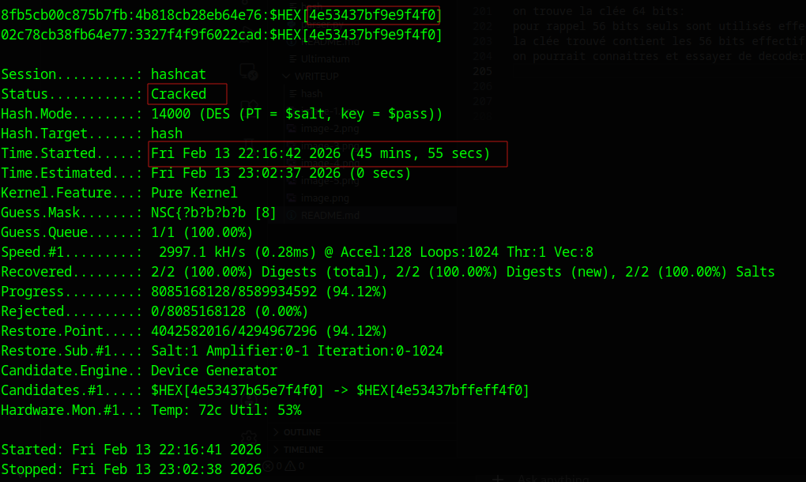
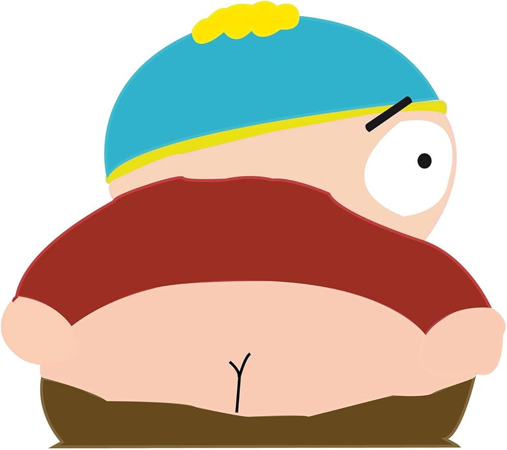

# DES CBC Known Plaintext + Charset Encoding + Stego

## Author: Scriptmagum

`#des #cbc #known_plaintext #cp1251 #hashcat #steganography`


# Steps to solve the chall

We are given an encrypted file named Ultimatum.
Our goal: recover the hidden flag.

The challenge involves:

DES encryption in CBC mode

Known plaintext attack

Key parity manipulation

Charset encoding (cp1251)

Steganography extraction


# 🧠 Level 1 — Crypto (DES + CBC + Known Plaintext)


### File type

The file **Ultimatum** is encrypted using **DES in CBC mode**.


### mcrypt

The encryption was done using **mcrypt**, an old Linux encryption utility (aka: legacy stuff 👴).

```bash
mcrypt -a des -c cbc -o hex Ultimatum.jpg
```


### DES weakness

DES uses a **64-bit key**, but **only 56 bits are actually effective**.
The remaining **8 bits are parity bits**.

→ **Bruteforce friendly.**

### Known plaintext

The encrypted file is a **JPEG**, which is interesting because the **first 16 bytes are always known**:

```
FF D8 FF E0 00 10 4A 46 49 46 00 01 01 00 00 01
```

Quick breakdown:

* FF D8 → SOI (Start Of Image)
* FF E0 → APP0 marker
* 00 10 → segment length
* 4A 46 49 46 00 → "JFIF\0"
* 01 01 → version
* 00 → density unit
* 00 01 → horizontal density
* 00 01 → vertical density


### DES CBC reminder



Each DES block = **8 bytes**.

So we know:

```
p1 = first 8 bytes of the JPEG header
p2 = next 8 bytes
```

Therefore, DES-CBC is vulnerable to a **known plaintext attack**.

We only need:

```
IV + C1 + C2
```


### mcrypt structure

From the official documentation:
[https://github.com/jackspirou/mcrypt/tree/master/doc](https://github.com/jackspirou/mcrypt/tree/master/doc)

Format:

```
NULL + "m" + \3
flag
algo\0
keylen
mode\0
keygen\0
checksum_algo\0
IV
ciphertext
checksum
```

The **IV if exists is located immediately after checksum_algo\0**.

So we just parse the file and extract:

```
IV, C1, C2
```

### Extract IV, C1, C2



```python
import sys

with open(sys.argv[1], 'rb') as f:
    data = f.read()

sha1_offset = data.find(b'sha1')

print(f"sha1 offset: 0x{sha1_offset:x}")
print(f"sha1: {data[sha1_offset:sha1_offset+4].decode()}")
print(f"IV:   {data[sha1_offset+5:sha1_offset+13].hex()}")
print(f"C1:   {data[sha1_offset+13:sha1_offset+21].hex()}")
print(f"C2:   {data[sha1_offset+21:sha1_offset+29].hex()}")
```

### Building the hash for hashcat

Hashcat expects DES-CBC hashes in the form:

```
hex(Cn):hex(Cn-1 xor Pn)
```

So:

```
C1 : IV xor P1
C2 : C1 xor P2
```

Script:

```python
import sys

with open(sys.argv[1], 'rb') as f:
    data = f.read()

sha1_offset = data.find(b'sha1')
iv = data[sha1_offset+5:sha1_offset+13]
c1 = data[sha1_offset+13:sha1_offset+21]
c2 = data[sha1_offset+21:sha1_offset+29]

jpeg_header = bytes.fromhex("ffd8ffe000104a464946000101000001")

p1 = jpeg_header[:8]
p2 = jpeg_header[8:16]

iv_xor_p1 = bytes(a ^ b for a,b in zip(iv,p1))
c1_xor_p2 = bytes(a ^ b for a,b in zip(c1,p2))

print(f"{c1.hex()}:{iv_xor_p1.hex()}")
print(f"{c2.hex()}:{c1_xor_p2.hex()}")
```

### Bruteforce with hashcat

Naive bruteforce:

```bash
hashcat -m 14000 hash -a 3 '?a?a?a?a?a?a?a?a'
```

→ around **11 months**, even with a good GPU 💀

But we know the flag prefix:

```
NSC{
```

So:

```bash
hashcat -m 14000 hash -a 3 'NSC{?a?a?a?a'
```

This is fast, but encoding is unknown.
Since the challenge hints **Russia** → **no-utf-8** → **Cyrillic** → brute-force **raw bytes**.

So:

```bash
hashcat -m 14000 hash -a 3 'NSC{?b?b?b?b'
```

Worst case: **~45 minutes**.



Now we wait…


mandatory coffee ☕ + existential crisis



---

### Result

Recovered DES key:

```
4e53437bf9e9f4f0
```

Reminder: **DES uses only 56 effective bits**, so the 8 parity bits might be wrong.

But tools ignore parity, so we decrypt anyway:

```bash
mcrypt -d Ultimatum
```

→ We get a beautiful picture of Cartman:




# 🕵️ Level 2 — Steganography (Parity bits + cp1251 + brute-force)

The image probably hides a secret.

```bash
steghide extract -sf Cartman.jpg -p <pass>
```

The passphrase is the **same key**, but now encoded using **cp1251**.

### DES parity → 256 possible  keys

DES ignores parity bits → **256 possible  keys** for the same effective DES key.

Script:

```python
from itertools import product
key_hex = "4e53437bf9e9f4f0"
key = bytes.fromhex(key_hex)
def set_des_parity(b, p):
    return (b & 0xfe) | p
for mask in product([0,1], repeat=8):
    k = bytes(set_des_parity(b,p) for b,p in zip(key,mask))
    try:
        if b'NSC{' in k:
            print(k.hex(), k.decode("cp1251"))
    except:
        pass
```

We get **16 candidate passwords** cuz of filter:

```
NSC{шифр
NSC{шифс
NSC{шихр
NSC{шихс
NSC{шйфр
NSC{шйфс
NSC{шйхр
NSC{шйхс
NSC{щифр
NSC{щифс
NSC{щихр
NSC{щихс
NSC{щйфр
NSC{щйфс
NSC{щйхр
NSC{щйхс
```

### Bruteforce steghide

```python
from itertools import product
import subprocess
key_hex = "4e53437bf9e9f4f0"
img = "Cartman.jpg"
key = bytes.fromhex(key_hex)
def set_des_parity(b,p):
    return (b & 0xfe) | p

for mask in product([0,1], repeat=8):
    k = bytes(set_des_parity(b,p) for b,p in zip(key,mask))
    try:
        s = k.decode("cp1251")
        if s.startswith("NSC{"):
            p = subprocess.run(
                ["steghide","extract","-sf",img,"-p",s],
                stdout=subprocess.PIPE,
                stderr=subprocess.PIPE
            )
            out = (p.stdout+p.stderr).decode(errors="ignore")
            if "criture des donn" in out or "writing extracted" in out.lower():
                print("[+] KEY FOUND:", s, k.hex())
                break
    except:
        pass
```
### Final result

```
[+] KEY FOUND: NSC{шифр 4e53437bf8e8f4f0
```

Contents of `secret.txt`:

```
_DES_устарел_и_небезопасен_для_современных_систем}
```

# 🏁 Final Flag

```
NSC{шифр_4e53437bf8e8f4f0_DES_устарел_и_небезопасен_для_современных_систем}
```