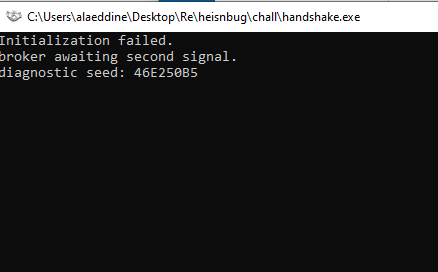

# Handshake // Author: Fairalien
## Difficulty: Medium

## **Idea**

The binary is not actually dead. It creates a hidden window, a named event, and a shared memory mapping, then waits for a 2 step handshake.

The solve is:

1. Send the correct WM_COPYDATA payload to the hidden window
2. Signal the named event

If both steps are correct and in order, the program reveals the real flag.

## Step 1: Run the binary first



Important thing to notice:

- the process stays alive

So the first conclusion is:

- this program is waiting for something
- it is probably not a normal password checker

## **Step 2: Ghidra**

If you have no idea what to search for, begin with imports.

Open:

- Symbol Tree
- expand Imports


Look for Windows APIs like these:

- CreateWindowExW
- RegisterClassExW
- CreateEventW
- CreateFileMappingW
- MapViewOfFile
- GetProcessTimes

Why these matter:

- CreateWindowExW means the program creates a window
- CreateEventW means it uses a named event
- CreateFileMappingW means it may use shared memory
- GetProcessTimes means runtime values like creation time may matter

These imports already tell you this is a Windows API challenge.

## **Step 3: Follow CreateWindowExW**

Double click CreateWindowExW, then press ctrl+shift+f to view references.


Open the function that calls it.

In that function you should see strings like:

- TaskCacheNotificationWindow
- BackgroundTransferHost


This tells you:

- the program creates a hidden window
- another process can probably talk to it using Windows messages

Also in that same setup code you should see:

- RegisterClassExW
- CreateWindowExW
- ShowWindow(..., SW_HIDE)

That confirms it is a hidden window.

## **Step 4: Find the window procedure**

In the window creation code, find the function pointer assigned to lpfnWndProc.

Jump to that function.

This is the most important function in the challenge.

Inside it, you are looking for:

- a branch for message 0x4A
- timer logic
- event checks

Note:


- 0x4A is WM_COPYDATA

So now you know the program expects another process to send it data through a Windows message.

## **Step 5: Reverse the WM_COPYDATA check**

In the WM_COPYDATA branch, follow the helper function or inline code that validates the incoming data.


You should recover these facts:

- COPYDATASTRUCT.dwData must be 0x5349474E
- the incoming text must match: `SECOND:%08X:%08X`

This is the protocol.

At this point the challenge is no longer mysterious. It wants a specific message.

## **Step 6: Find where the 2 numbers come from**

Now follow the code that builds that expected string.

You will find two computed values. In source terms they are:

- knock
- echo

They are:

- DAT_1400286cc
- DAT_1400286d0

So to find knock and echo, do this: 

- **Click DAT_1400286d0**

In the decompiler, click on: `local_b8 = DAT_1400286d0;`  and open references


You want the place where this global is **written**, not just read.

That write location is where the first value is computed.

- **Click DAT_1400286cc**

we should find where DAT_1400286cc is written too


- DAT_1400286cc written at 140001c90
- DAT_1400286d0 written at 140001cb8

And the decompiled function FUN_140001bd0, clearly computes both of them one after the other.

so both `%08X` values in the expected payload are generated in the same initialization function, right after the binary reads its PID and process creation time.

### **What this function does**

It does 4 important things:

1. Gets runtime info
    - PID with GetCurrentProcessId()
    - process creation time with GetProcessTimes()
2. Computes the 2 numbers used in the payload
    - DAT_1400286cc
    - DAT_1400286d0
3. Creates the Windows objects
    - event: Local\\TaskCache.SecondSignal
    - mapping: Local\\TaskCache.DispatchNote
4. Creates the hidden window
    - class: TaskCacheNotificationWindow
    - title: BackgroundTransferHost

So this one function basically gives you the whole solve.

### **Rename these globals mentally**

From this function:

- _DAT_1400286c0 = pid
- _DAT_1400286c4 = birthLow
- DAT_1400286c8 = birthHigh
- DAT_1400286cc = first payload value
- DAT_1400286d0 = second payload value

The payload is: `SECOND:%08X:%08X`

So the order is: `SECOND:<DAT_1400286cc>:<DAT_1400286d0>`

Meaning:

- first hex = DAT_1400286cc
- second hex = DAT_1400286d0

### **The exact formulas**

#### **First value: DAT_1400286cc**

From this block:

```c
uVar17 = (_DAT_1400286c0 ^ 0x9e3779b9) + _DAT_1400286c4;
uVar17 = ((uVar17 >> 0x19 | uVar17 * 0x80) ^ local_48.dwHighDateTime + 0x7f4a7c15) +
         ((_DAT_1400286c4 ^ 0xa55aa55a) >> 0x15 | (_DAT_1400286c4 ^ 0xa55aa55a) << 0xb);
DAT_1400286cc = (uVar17 >> 0x1d | uVar17 * 8) ^ 0x51ed270b;
```

Equivalent cleaner form:

```c
uint32_t knock(uint32_t pid, uint32_t lo, uint32_t hi) {
    uint32_t v = pid ^ 0x9E3779B9u;
    v = rotl32(v + lo, 7) ^ (hi + 0x7F4A7C15u);
    v += rotl32(lo ^ 0xA55AA55Au, 11);
    return rotl32(v, 3) ^ 0x51ED270Bu;
}
```

So:

- DAT_1400286cc = knock(pid, birthLow, birthHigh)

#### **Second value: DAT_1400286d0**

From this block:

```c
uVar17 = DAT_1400286cc ^ local_48.dwHighDateTime ^ 0xd3c4b2a1;
uVar17 = (uVar17 >> 0x17 | uVar17 << 9) + (_DAT_1400286c4 ^ 0x10293847);
DAT_1400286d0 = (uVar17 >> 0x19 | uVar17 * 0x80) ^ 0x6b4f123d;
```

Equivalent cleaner form:

```c
uint32_t echo(uint32_t k, uint32_t lo, uint32_t hi) {
    uint32_t v = rotl32(k ^ hi ^ 0xD3C4B2A1u, 9);
    v += (lo ^ 0x10293847u);
    return rotl32(v, 7) ^ 0x6B4F123Du;
}
```

So:

- DAT_1400286d0 = echo(DAT_1400286cc, birthLow, birthHigh)

### **Other important values found in this function**

#### **Event name**

```c
CreateEventW(..., L"Local\\TaskCache.SecondSignal")
```

So after sending the message, your solver must signal: `Local\TaskCache.SecondSignal`

### **Mapping name**

```c
CreateFileMappingW(..., L"Local\\TaskCache.DispatchNote")
```

That is where the real flag is written later.

### **Hidden window**

```c
RegisterClassExW(...)
local_98.lpszClassName = L"TaskCacheNotificationWindow";
CreateWindowExW(..., L"TaskCacheNotificationWindow", L"BackgroundTransferHost", ...)
ShowWindow(..., 0);
```

So your solver must find:

- class: TaskCacheNotificationWindow
- title: BackgroundTransferHost

## Step 7: Find the second stage

The window procedure `FUN_140001910` handles 3 important messages:

- `param_2 == 2` -> `WM_DESTROY`
- `param_2 == 0x4a` -> `WM_COPYDATA`
- `param_2 == 0x113` -> `WM_TIMER`

The key branch is:

```c
if (param_2 != 0x113) {
    uVar3 = DefWindowProcW(param_1,param_2,param_3,(LPARAM)param_4);
    return uVar3;
}
```

This means the code that follows is the WM_TIMER path.

Inside that timer branch, the program checks:

```c
if ((param_3 == 0xbeef) && (DAT_140028692 == '\0')) {
    DVar2 = WaitForSingleObject(DAT_1400286b8,0);
```

WaitForSingleObject(..., 0) == 0 means the event is signaled.

From the initialization function, we already know:

- 0xbeef is the timer ID
- DAT_1400286b8 is the handle returned by:
    - CreateEventW(..., L"Local\\TaskCache.SecondSignal")

So the second stage is:

- the program waits for the named event Local\TaskCache.SecondSignal

If the event is signaled, this branch continues.

#### **Stage 1 must already be valid**

After the event is detected, the program checks:

```c
pvVar4 = GetPropW(DAT_1400286a0,L"cache.ticket");
...
if (((iVar7 == (int)pvVar4) && (iVar7 == -0x73914676)) &&
    (DAT_1400286a8 == 0x4c6f7374))
```

This shows that the event alone is not enough.

The binary requires that stage 1 already succeeded, because the WM_COPYDATA path must have already:

- set the window property cache.ticket
- written the same marker into the shared mapping
- set DAT_1400286a8 == 0x4c6f7374

So the correct order is:

1. send the valid WM_COPYDATA payload
2. signal Local\TaskCache.SecondSignal

If you signal the event too early, the program marks the sequence as broken.

### **Evidence of failure on wrong order**

If the checks fail, the code sets:`DAT_140028691 = '\x01';`

and writes:`"EARLY_SIGNAL"`

into the mapping.

That is the binary explicitly telling us the event happened too early.

## **Step 8: Find the flag reveal path**

If all checks pass, the timer branch calls: `FUN_140001420(local_38,DAT_1400286b0,param_3);`

This function produces the real flag string.

Then the binary:

1. writes the flag into the shared mapping at offset 0x80
2. shows it with: `MessageBoxA((HWND)0x0,(LPCSTR)ppppCVar8,"broker restored",0x40);`

So the real flag only appears after:

- valid WM_COPYDATA
- valid event signal
- correct order

### **What we learn from this function**

This confirms the full solve flow:

1. Find the hidden window
2. Compute the two payload values
3. Send:
    - SECOND:<DAT_1400286cc>:<DAT_1400286d0>using WM_COPYDATA
4. Signal:
    - Local\TaskCache.SecondSignal
5. The timer branch notices the event and, if stage 1 is valid, reveals the real flag

## Step 9: Write and run the solver

At this point we have everything needed:

- hidden window class: `TaskCacheNotificationWindow`
- hidden window title: `BackgroundTransferHost`
- event name: `Local\\TaskCache.SecondSignal`
- `WM_COPYDATA` tag: `0x5349474E`
- payload format: `SECOND:%08X:%08X`
- first value: `DAT_1400286cc`
- second value: `DAT_1400286d0`

The solver only needs to reproduce the runtime values and send the handshake.

### Solver logic

1. Find the hidden window
2. Get its PID
3. Open the process
4. Read process creation time with `GetProcessTimes`
5. Compute the first value
6. Compute the second value
7. Build the payload string
8. Send it with `WM_COPYDATA`
9. Signal `Local\\TaskCache.SecondSignal`

### Solver code

```cpp
#include <windows.h>
#include <cstdio>
#include <cstdint>
#include <cstring>

static uint32_t rotl32(uint32_t v, int b) {
    return (v << b) | (v >> (32 - b));
}

static uint32_t knock(uint32_t pid, uint32_t lo, uint32_t hi) {
    uint32_t v = pid ^ 0x9E3779B9u;
    v = rotl32(v + lo, 7) ^ (hi + 0x7F4A7C15u);
    v += rotl32(lo ^ 0xA55AA55Au, 11);
    return rotl32(v, 3) ^ 0x51ED270Bu;
}

static uint32_t echo(uint32_t k, uint32_t lo, uint32_t hi) {
    uint32_t v = rotl32(k ^ hi ^ 0xD3C4B2A1u, 9);
    v += (lo ^ 0x10293847u);
    return rotl32(v, 7) ^ 0x6B4F123Du;
}

int main() {
    HWND w = FindWindowW(L"TaskCacheNotificationWindow", L"BackgroundTransferHost");
    if (!w) return 1;

    DWORD pid = 0;
    GetWindowThreadProcessId(w, &pid);

    HANDLE p = OpenProcess(PROCESS_QUERY_LIMITED_INFORMATION, FALSE, pid);
    if (!p) return 1;

    FILETIME ct{}, et{}, kt{}, ut{};
    if (!GetProcessTimes(p, &ct, &et, &kt, &ut)) return 1;
    CloseHandle(p);

    uint32_t k = knock(pid, ct.dwLowDateTime, ct.dwHighDateTime);
    uint32_t e = echo(k, ct.dwLowDateTime, ct.dwHighDateTime);

    char msg[64]{};
    std::snprintf(msg, sizeof(msg), "SECOND:%08X:%08X", k, e);

    COPYDATASTRUCT cds{};
    cds.dwData = 0x5349474E;
    cds.cbData = (DWORD)std::strlen(msg) + 1;
    cds.lpData = msg;

    if (!SendMessageW(w, WM_COPYDATA, 0, (LPARAM)&cds)) return 1;

    HANDLE ev = OpenEventW(EVENT_MODIFY_STATE, FALSE, L"Local\\\\TaskCache.SecondSignal");
    if (!ev) return 1;

    SetEvent(ev);
    CloseHandle(ev);
    return 0;
}
```

### **Build**

Build the solver as:

- x64
- Release

### **Run**

1. Start the challenge binary
2. Run the solver
3. the challenge process must still be running when you launch the solver

If everything is correct:

- the challenge accepts the payload
- the event triggers the second stage
- the program reveals the real flag

### **Final flag**

`NSC{wh0_kn0ck5_tw1c3_0wn5_th3_h4unt}`

## Fake Flag

While reversing the binary, you may find this flag-looking string: NSC{c0pyd4t4_b3f0r3_53t3v3nt}

This is a fake flag.

#### Why it exists

The binary contains a simple static decryption path that produces a believable NSC{...} value. It is there to mislead shallow static analysis and anyone who stops after finding the first flag-shaped string.

The real flag is only revealed after:

1. sending the correct WM_COPYDATA payload
2. signaling the named event in the correct order

So the fake flag is just a decoy. The real flag is the one produced by the runtime handshake.
